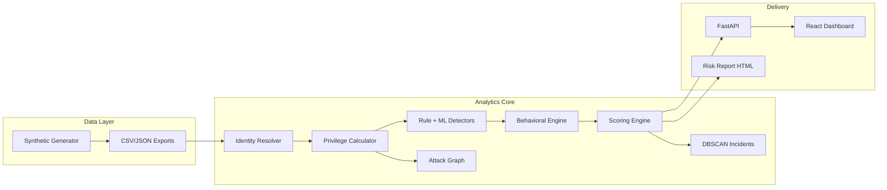

# IdentitySphere AI — Architecture (Option A)

Graph-based cross-platform identity intelligence for hybrid enterprises. Implements the **Option A** track: NetworkX privilege graph, scikit-learn anomaly detection, explainable composite scoring, DBSCAN incident clustering, FastAPI + React dashboard.

## System diagram



## Pipeline stages (10)

| # | Stage | Module | Output |
|---|-------|--------|--------|
| 1 | Generate synthetic data | `generators/synthetic.py` | Raw identities, groups, audit events |
| 2 | Ingest + base graph | `core/ingest.py` | Unified store, NetworkX graph |
| 3 | Inject duplicate fragments | `core/duplicate_injector.py` | Cross-platform resolver exercise |
| 4 | Identity resolution | `core/resolver.py` | 385 → 370 merged identities |
| 5 | Effective privilege | `core/privilege.py` | Nested group traversal, privilege scores |
| 6 | Rule + ML detection | `core/detectors.py` | Risk events (orphaned, offboarding, token, etc.) |
| 7 | Behavioral profiling | `core/behavioral.py` | Isolation Forest on access patterns |
| 8 | Composite scoring | `core/scoring.py` | Explainable scores + alert consolidation |
| 9 | Attack graph + blast radius | `core/graph.py`, `blast_radius.py` | Lateral movement paths |
| 10 | Incident clustering + export | `core/incidents.py`, `export_api_artifacts.py` | DBSCAN clusters, API JSON |

Run: `python main.py`

## AI / ML approach

### 1. Cross-platform identity resolution (deterministic + weighted)

- Match candidates on **email** (weight 1.0), **display name** (0.7), **username pattern** (0.5)
- Merge when confidence ≥ 0.6 (`identity_resolver.min_confidence_threshold`)
- Handles same person with different usernames across AD / AWS / Okta

### 2. Effective privilege (graph traversal)

- NetworkX directed graph: `identity → account → group → permission → resource`
- Recursive ancestor resolution up to depth 10
- Weights: admin (10×), write (3×), read (1×), sensitive resource (2.5×), cross-platform admin (3×)

### 3. Rule-based detectors

| Detector | Scenario |
|----------|----------|
| `orphaned_account` | HR terminated but platform accounts active |
| `offboarding_gap` | Partial deprovisioning after termination |
| `cross_platform_admin` | Admin on 2+ platforms |
| `privilege_escalation` | Unexpected group/role additions in audit log |
| `token_abuse` | Stale tokens (>180d), unusual hour, new IP |
| `stale_account` | Admin + >90 days dormant |
| `mfa_disabled` | Active account without MFA |
| `sod_violation` | Toxic privilege combinations |

### 4. Isolation Forest (unsupervised)

Two models:

- **Detector IF** (`detectors.py`): contamination 10%, 200 estimators — flags anomalous privilege/feature vectors
- **Behavioral IF** (`behavioral.py`): login frequency, platform spread, hour-of-day, privilege-to-usage ratio

False-positive traps (on-call admins, recent role changes) receive **suppression discounts** (0.45–0.60×).

### 5. Composite risk scoring

```
composite = (privilege_breadth×0.25 + cross_platform×0.20 + dormancy×0.15
            + detector_severity×0.25 + behavioral_anomaly×0.15) × suppression_multiplier
```

Suppressions: active admin (−15%), MFA all platforms (−20%), on-call (−40%), recent role change (−30%).

### 6. Alert consolidation

Per-identity composite score replaces many raw detector alerts. Target: ≥40% reduction (achieved ~88%).

### 7. DBSCAN incident clustering

- Features: risk type one-hot, severity, platform count, score
- `eps=0.45`, `min_samples=2` — groups related signals into actionable incidents

### 8. Security Copilot (optional LLM)

- `core/copilot.py` + `core/llm.py` — OpenAI-compatible API
- Default: **offline** template narratives (no API key required)
- Set `copilot.mode: online` and `OPENAI_API_KEY` for live LLM remediation text

## Evaluation metrics

| Metric | Latest run | Target |
|--------|------------|--------|
| Identity coverage | 100% | ≥95% |
| Alert consolidation | 88.4% | ≥40% |
| Detection precision | 69.2% | Audit-trustworthy |
| Detection recall | 84.4% | — |
| F1 score | 0.76 | — |
| FP traps flagged as TP | 0 | — |

## API surface

| Endpoint | Purpose |
|----------|---------|
| `GET /api/identities` | 370 resolved identities |
| `GET /api/risk-events` | All risk findings |
| `GET /api/incidents` | DBSCAN clusters |
| `GET /api/offboarding-gaps` | Cross-platform deprovisioning gaps |
| `GET /api/graph/{id}` | ReactFlow subgraph |
| `GET /api/scores/{id}` | Explainable factor breakdown |
| `GET /api/risk-report/html` | Sample audit report |
| `POST /api/pipeline/run` | Full re-run |

## Frontend

- `PlatformDataProvider` loads pipeline data on startup
- Admin pages read via `storageService` → `getPlatformCache()` (live API data)
- Visualizations: Recharts (charts), ReactFlow (attack paths), custom heatmap table

## Framework alignment

| Framework | Controls mapped |
|-----------|-----------------|
| NIST SP 800-53 | AC-2, AC-6, IA-4 |
| MITRE ATT&CK | T1078, T1098, T1550 |
| GDPR | Art. 5, Art. 32 |
| CIS | Controls 5, 6 |

## Key files

```
identitysphere/config/settings.yaml   # Tunable weights and thresholds
identitysphere/core/pipeline.py       # Orchestrator
identitysphere/core/risk_report.py    # HTML report generator
identitysphere/core/offboarding_gaps.py # Gap aggregation
api_server.py                         # REST API
frontend/src/context/PlatformDataContext.jsx
```

## Data dictionary

See [docs/DATA_DICTIONARY.md](docs/DATA_DICTIONARY.md) for full schema of all 8 export files.
