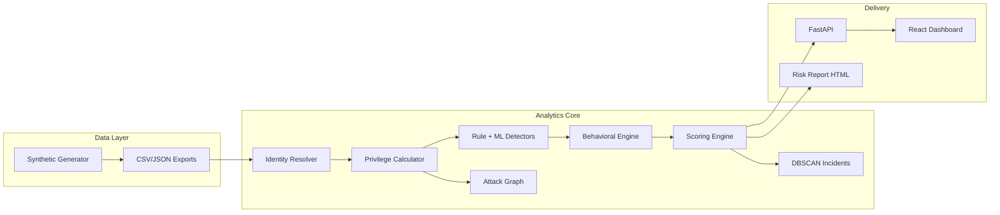

<h1 align="center">IdentitySphere AI</h1>

<p align="center">
  <strong>Graph-based cross-platform identity intelligence for hybrid enterprises</strong>
</p>

<p align="center">
  <a href="https://identity-sphere-ai.vercel.app/" target="_blank"><strong>🚀 Live Demo</strong></a>
</p>

<p align="center">
  <a href="#features">Features</a> •
  <a href="#tech-stack">Tech Stack</a> •
  <a href="#getting-started">Getting Started</a> •
  <a href="#demo-credentials">Demo Credentials</a> •
  <a href="#architecture">Architecture</a> •
  <a href="#api-reference">API Reference</a> •
  <a href="#project-structure">Project Structure</a> •
  <a href="#testing">Testing</a> •
  <a href="#deployment">Deployment</a> •
  <a href="#documentation">Documentation</a> •
  <a href="#license">License</a>
</p>

<p align="center">
  
  
  
  
  
  <a href="https://identity-sphere-ai.vercel.app/" target="_blank"></a>
</p>

---

IdentitySphere AI consolidates identity signals from **Active Directory, Azure AD, AWS IAM, Okta, Salesforce, and ServiceNow** into a unified graph. It computes effective privilege through nested group traversal, detects cross-platform abuse patterns using rule-based and ML-driven detectors, and surfaces explainable remediation through an interactive SOC dashboard.

Built as the **Option A** implementation for the *Identity Sprawl & Privileged Access Abuse* hackathon challenge.

## Live Demo

**Production:** [https://identity-sphere-ai.vercel.app/](https://identity-sphere-ai.vercel.app/)

| Portal | URL |
|--------|-----|
| Landing | https://identity-sphere-ai.vercel.app/ |
| Login | https://identity-sphere-ai.vercel.app/login |
| Admin SOC | https://identity-sphere-ai.vercel.app/admin |

Use the [demo credentials](#demo-credentials) below to explore each role dashboard.

## Features

- **Cross-Platform Identity Resolution** — Merges 385+ identity fragments into 370 unified profiles using email, display name, and username matching across 6 platforms
- **Effective Privilege Computation** — NetworkX-powered graph traversal resolves nested group memberships up to depth 10, weighting admin (10x), write (3x), and sensitive resources (2.5x)
- **8 Rule-Based Detectors** — Orphaned accounts, offboarding gaps, cross-platform admin, privilege escalation, token abuse, stale accounts, MFA gaps, and SoD violations
- **ML Anomaly Detection** — Isolation Forest models for both access pattern anomalies and behavioral profiling (login frequency, hour-of-day, platform spread)
- **Explainable Risk Scoring** — 5-factor composite score with false-positive suppression for on-call admins, recent role changes, and MFA-compliant users
- **DBSCAN Incident Clustering** — Groups related alerts into actionable incidents, achieving ~88% alert consolidation
- **Attack Path Visualization** — Interactive ReactFlow graphs showing lateral movement paths and blast radius analysis
- **Role-Based Dashboards** — Separate views for Admin/SOC, Auditor, Executive, Employee, and Contractor roles
- **Security Copilot** — Template-based remediation narratives (optional LLM integration via OpenAI-compatible API)
- **Compliance Mapping** — Aligned with NIST SP 800-53, MITRE ATT&CK, GDPR, and CIS Controls

## Tech Stack

| Layer | Technologies |
|-------|-------------|
| **Backend** | Python 3.11, FastAPI, NetworkX, scikit-learn, Pandas, NumPy |
| **Frontend** | React 19, Vite 8, Tailwind CSS 4, Recharts, ReactFlow, Framer Motion, Three.js |
| **ML/AI** | Isolation Forest (scikit-learn), DBSCAN clustering, weighted identity resolution |
| **Data** | Enterprise-scale synthetic identity dataset (370 identities, 7 platforms, 800 audit events) generated using configurable simulation pipelines |
| **Deployment** | Vercel (frontend), Uvicorn (API server) |

## Getting Started

### Prerequisites

- Python 3.11+
- Node.js 18+
- npm or yarn

### Installation

```bash
# Clone the repository
git clone https://github.com/PradeepTech-hub/IdentitySphere-AI.git
cd IdentitySphere-AI

# Install Python dependencies
pip install -r requirements.txt

# Generate synthetic data and run the detection pipeline (~20s)
python main.py

# Build frontend static data from CSV exports
python build_frontend_data.py

# Start the API server (port 8000)
python -m uvicorn api_server:app --reload --port 8000

# In a new terminal — start the React dashboard (port 5173)
cd frontend
npm install
npm run dev
```

Open http://localhost:5173 to access the landing page.

### Quick Start (Windows)

```powershell
# Use the included start script
.\start.ps1
```

## Demo Credentials

Login at http://localhost:5173/login.html

| Role | Email | Password |
|------|-------|----------|
| Admin | `admin@identitysphere.ai` | `Admin123!Secure` |
| Auditor | `auditor@identitysphere.ai` | `Admin123!Secure` |
| Executive | `executive@identitysphere.ai` | `Admin123!Secure` |
| Employee | `employee@identitysphere.ai` | `Admin123!Secure` |
| Contractor | `contractor@identitysphere.ai` | `Admin123!Secure` |

Each role has a dedicated dashboard view tailored to their responsibilities.

## Architecture



### Pipeline Stages

| # | Stage | Description |
|---|-------|-------------|
| 1 | **Data Generation** | 370 synthetic identities across 6 platforms with labeled ground truth |
| 2 | **Ingestion** | Builds unified store and NetworkX graph |
| 3 | **Duplicate Injection** | Creates cross-platform identity fragments for resolution testing |
| 4 | **Identity Resolution** | Merges duplicates using weighted email/name/username matching |
| 5 | **Privilege Computation** | Nested group traversal for effective privilege scoring |
| 6 | **Detection** | Rule-based + Isolation Forest anomaly detection |
| 7 | **Behavioral Profiling** | Login frequency, platform spread, and usage pattern analysis |
| 8 | **Risk Scoring** | Explainable 5-factor composite with FP suppression |
| 9 | **Attack Graphs** | Lateral movement paths and blast radius computation |
| 10 | **Incident Clustering** | DBSCAN groups related alerts into incidents |

### Scoring Formula

```
composite = (privilege_breadth × 0.25 + cross_platform × 0.20 + dormancy × 0.15
            + detector_severity × 0.25 + behavioral_anomaly × 0.15) × suppression
```

Suppression factors: active admin (-15%), MFA all platforms (-20%), on-call (-40%), recent role change (-30%).

### Performance Metrics

| Metric | Result | Target |
|--------|--------|--------|
| Identity Coverage | 100% | >= 95% |
| Alert Consolidation | ~88% | >= 40% |
| Detection Precision | 69.2% | Audit-trustworthy |
| Detection Recall | 84.4% | — |
| F1 Score | 0.76 | — |
| FP Traps Flagged as TP | 0 | 0 |

## API Reference

Base URL: `http://localhost:8000`

| Method | Endpoint | Description |
|--------|----------|-------------|
| `GET` | `/api/identities` | All 370 resolved identities |
| `GET` | `/api/risk-events` | Scored risk findings |
| `GET` | `/api/incidents` | DBSCAN incident clusters |
| `GET` | `/api/offboarding-gaps` | Cross-platform deprovisioning gaps |
| `GET` | `/api/graph/{person_id}` | Identity subgraph (ReactFlow format) |
| `GET` | `/api/scores/{person_id}` | Explainable factor breakdown |
| `GET` | `/api/risk-report/html` | Printable audit risk report |
| `POST` | `/api/pipeline/run` | Re-run the full detection pipeline |

## Project Structure

```
IdentitySphere-AI/
├── main.py                        # Pipeline entry point
├── api_server.py                  # FastAPI REST server
├── build_frontend_data.py         # Exports pipeline data for frontend
├── requirements.txt               # Python dependencies
├── vercel.json                    # Vercel deployment config
│
├── identitysphere/
│   ├── config/
│   │   └── settings.yaml          # Platforms, anomaly rates, scoring weights
│   ├── core/
│   │   ├── pipeline.py            # Pipeline orchestrator
│   │   ├── resolver.py            # Cross-platform identity resolution
│   │   ├── privilege.py           # Effective privilege calculation
│   │   ├── detectors.py           # Rule + ML risk detectors
│   │   ├── behavioral.py          # Behavioral profiling (Isolation Forest)
│   │   ├── scoring.py             # Composite risk scoring
│   │   ├── graph.py               # Attack graph construction
│   │   ├── blast_radius.py        # Blast radius analysis
│   │   ├── incidents.py           # DBSCAN incident clustering
│   │   ├── copilot.py             # Security Copilot narratives
│   │   └── risk_report.py         # HTML report generator
│   ├── generators/
│   │   └── synthetic.py           # Synthetic data generation (Faker)
│   └── data/generated/            # Pipeline outputs (CSV, JSON, HTML)
│
├── frontend/
│   ├── src/
│   │   ├── App.jsx                # Router and layout
│   │   ├── pages/
│   │   │   ├── landing/           # Public landing page
│   │   │   ├── auth/              # Login page
│   │   │   ├── admin/             # SOC admin dashboard (12 views)
│   │   │   ├── auditor/           # Auditor dashboard
│   │   │   ├── executive/         # Executive summary
│   │   │   ├── employee/          # Employee self-service (6 views)
│   │   │   └── contractor/        # Contractor dashboard
│   │   ├── components/
│   │   │   ├── charts/            # Recharts wrappers
│   │   │   ├── layout/            # Sidebar, DashboardLayout
│   │   │   ├── shared/            # GlassCard, StatCard, Heatmap, etc.
│   │   │   └── three/             # Three.js 3D backgrounds
│   │   └── context/               # Auth, PlatformData, Scenario providers
│   └── package.json
│
├── tests/                         # pytest test suite (15 test files)
├── docs/
│   ├── DATA_DICTIONARY.md         # Schema for all 8 export files
│   └── ML_METHODOLOGY.md          # ML approach documentation
└── ARCHITECTURE.md                # Detailed architecture documentation
```

## Testing

```bash
# Run the full test suite
pytest tests/ -v

# Run a specific test file
pytest tests/test_pipeline.py -v
```

The test suite covers: pipeline orchestration, identity resolution, privilege calculation, detectors, behavioral profiling, scoring, attack graphs, blast radius, incidents, copilot, and data export.

## Deployment

### Live Application (Vercel)

**URL:** [https://identity-sphere-ai.vercel.app/](https://identity-sphere-ai.vercel.app/)

The frontend is deployed on Vercel via `vercel.json`. It builds the React app from `frontend/` and serves it as a static site with SPA routing.

### Frontend (Vercel)

The frontend is configured for deployment on Vercel via `vercel.json`. It builds the React app from `frontend/` and serves it as a static site with SPA routing.

### Backend (Local / Cloud)

```bash
# Production server
python -m uvicorn api_server:app --host 0.0.0.0 --port 8000
```

## Re-run Pipeline

To regenerate synthetic data and refresh all outputs:

```bash
python main.py
python build_frontend_data.py
# Restart the API server or POST to /api/pipeline/run
```

All configurable parameters (identity count, anomaly rates, scoring weights, detector thresholds) are in `identitysphere/config/settings.yaml`.

## Documentation

- [PROJECT_DOCUMENTATION.md](docs/PROJECT_DOCUMENTATION.md) — Full project documentation (architecture, algorithms, UI design, screenshots)
- [PROJECT_DOCUMENTATION.docx](docs/PROJECT_DOCUMENTATION.docx) — Word export (regenerate: `python scripts/md_to_docx.py`)
- [ARCHITECTURE.md](ARCHITECTURE.md) — Pipeline stages, ML approach, evaluation metrics
- [docs/DATA_DICTIONARY.md](docs/DATA_DICTIONARY.md) — Schema for all 8 export CSV/JSON files
- [docs/ML_METHODOLOGY.md](docs/ML_METHODOLOGY.md) — Detailed ML methodology documentation

## Compliance Framework Alignment

| Framework | Controls |
|-----------|----------|
| **NIST SP 800-53** | AC-2, AC-6, IA-4 |
| **MITRE ATT&CK** | T1078, T1098, T1550 |
| **GDPR** | Art. 5, Art. 32 |
| **CIS Controls** | Controls 5, 6 |

## License

Educational / hackathon challenge submission prototype.

---

<p align="center">Built with purpose by <strong>Pradeep M</strong></p>
