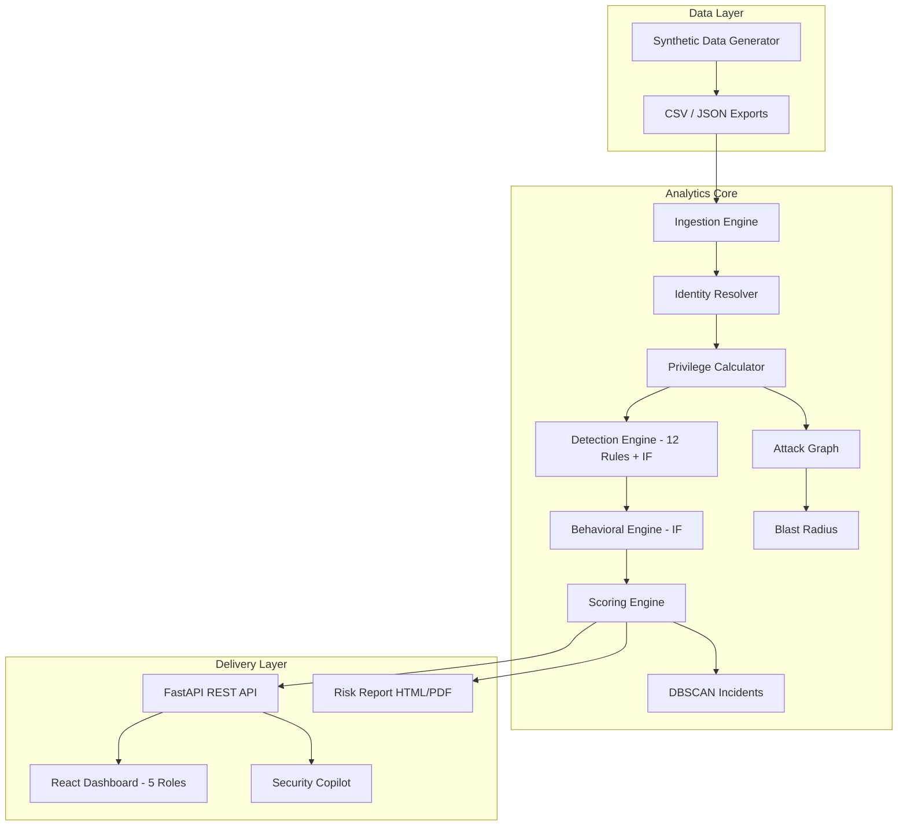

# IdentitySphere AI — Project Documentation

**Version:** 0.3.0  
**Track:** Identity & Access Risk Governance (Option A — Graph-Based Cross-Platform Identity Intelligence)  
**Organization:** Hybrid Enterprise Identity Security  
**Last Updated:** June 2026

---

## Table of Contents

1. [Executive Summary](#1-executive-summary)
2. [Platform Overview](#2-platform-overview)
3. [System Architecture](#3-system-architecture)
4. [Algorithm & Analytics Design](#4-algorithm--analytics-design)
5. [Data Model & Pipeline](#5-data-model--pipeline)
6. [API Reference](#6-api-reference)
7. [User Interface Design](#7-user-interface-design)
8. [Role-Based Access Model](#8-role-based-access-model)
9. [Compliance & Framework Alignment](#9-compliance--framework-alignment)
10. [Evaluation Metrics](#10-evaluation-metrics)
11. [Deployment & Operations](#11-deployment--operations)
12. [Appendices](#12-appendices)

---

## 1. Executive Summary

**IdentitySphere AI** is a graph-based cross-platform identity intelligence platform built for hybrid enterprises. It consolidates identity signals from Active Directory, Azure AD, AWS IAM, Okta, Salesforce, ServiceNow, and GitHub into a unified view, computes effective privilege (including nested group inheritance), detects privilege abuse patterns, scores and clusters risky identities, and generates explainable remediation guidance.

### Problem Statement

Enterprise identity data is fragmented across IAM platforms. A user disabled in Active Directory may remain active in Okta and AWS — invisible to both teams. Attackers exploit these **seams** for lateral movement without malware.

### Solution Highlights

| Capability | Description |
|------------|-------------|
| Cross-platform resolver | Merges 385 identity fragments → 328 unified persons |
| Effective privilege graph | NetworkX traversal through nested groups (depth 10) |
| Hybrid detection | 12 rule detectors + 2 Isolation Forest models |
| Explainable scoring | 5-factor composite with suppression audit trail |
| Alert consolidation | 88.6% reduction (553 raw signals → 63 incidents) |
| Role-based portals | Admin, Auditor, Executive, Employee, Contractor |

### Success Metrics (Latest Pipeline Run)

| Metric | Target | Achieved |
|--------|--------|----------|
| Identity coverage | ≥95% | **100%** |
| Alert consolidation | ≥40% | **88.6%** |
| Risk scenarios detected | Multiple | **12 types** |
| Risk explainability | Traceable | **5-factor breakdown** |
| Sample risk report | 5–10 identities | **10 with remediation** |

---

## 2. Platform Overview

### 2.1 Supported Identity Platforms

IdentitySphere ingests and correlates signals from seven enterprise platforms:

| Platform | Identifier | Privilege Model | Typical Signals |
|----------|------------|-----------------|-----------------|
| **Active Directory** | `active_directory` | Nested security groups, GPO | sAMAccountName, group membership, lastLogon |
| **Azure AD** | `azure_ad` | Role assignments, PIM | UPN, directory roles, conditional access |
| **AWS IAM** | `aws_iam` | IAM policies, roles, SCPs | Access keys, role assumption, policy attachments |
| **Okta** | `okta` | Group + app assignments | SSO sessions, API tokens, MFA status |
| **Salesforce** | `salesforce` | Profiles, permission sets | OAuth tokens, profile hierarchy |
| **ServiceNow** | `servicenow` | Roles, ACLs | Service accounts, elevated roles |
| **GitHub** | `github` | Org/team/repo permissions | PATs, SSH keys, org admin |

### 2.2 Identity Types

| Type | Count (typical) | Risk Profile |
|------|-----------------|--------------|
| Human | 300 | Standard workforce — joiner/mover/leaver lifecycle |
| Service | 50 | High privilege creep risk — requires owner assignment |
| External | 20 | Contractor/vendor — highest offboarding gap risk |

### 2.3 Technology Stack

| Layer | Technology | Purpose |
|-------|------------|---------|
| **Backend** | Python 3.11+, FastAPI, Uvicorn | REST API, pipeline orchestration |
| **Analytics** | NetworkX, scikit-learn, NumPy, Pandas | Graph traversal, ML, data processing |
| **Frontend** | React 19, Vite 8, Tailwind CSS 4 | Role-based SOC dashboard |
| **Visualization** | Recharts, ReactFlow, Framer Motion | Charts, attack graphs, animations |
| **Storage** | CSV/JSON artifacts | Pipeline exports, API-first data layer |

---

## 3. System Architecture

### 3.1 High-Level Architecture



### 3.2 Pipeline Stages (10-Step)

| Stage | Module | Input | Output |
|-------|--------|-------|--------|
| 1 | `generators/synthetic.py` | Config YAML | 370 identities, 800 audit events, groups |
| 2 | `core/ingest.py` | CSV/JSON | Unified store, base NetworkX graph (1,418 nodes) |
| 3 | `core/duplicate_injector.py` | Identities | 15 cross-platform fragments for resolver testing |
| 4 | `core/resolver.py` | Fragmented IDs | 328 merged identities (98.6% avg confidence) |
| 5 | `core/privilege.py` | Graph + memberships | Effective privilege scores per identity |
| 6 | `core/detectors.py` | Profiles + audit events | 553 risk events across 12 detector types |
| 7 | `core/behavioral.py` | Audit events | Behavioral profiles, IF anomaly scores |
| 8 | `core/scoring.py` | Risk events + behavioral | Composite scores, 88.6% consolidation |
| 9 | `core/graph.py`, `blast_radius.py` | Privilege graph | Attack paths, blast radius, what-if |
| 10 | `core/incidents.py`, `export_api_artifacts.py` | Scored events | DBSCAN clusters, API JSON artifacts |

**Entry point:** `python main.py` (~35 seconds per run)

### 3.3 Component Dependency Map

```
identitysphere/
├── config/settings.yaml          # Tunable weights, thresholds, platform list
├── generators/synthetic.py       # Labeled ground-truth data generation
├── core/
│   ├── pipeline.py               # Orchestrator
│   ├── ingest.py                 # Data loading + base graph
│   ├── resolver.py               # Cross-platform identity merge
│   ├── privilege.py              # Effective privilege calculator
│   ├── detectors.py              # 12 rule + ML hybrid detectors
│   ├── behavioral.py             # Isolation Forest behavioral profiling
│   ├── scoring.py                # 5-factor composite scoring
│   ├── graph.py                  # Attack graph enrichment
│   ├── blast_radius.py           # Compromise impact analysis
│   ├── incidents.py              # DBSCAN clustering
│   ├── copilot.py                # AI remediation narratives
│   └── governance_routes.py      # Auth + access request API
├── data/generated/               # Pipeline outputs
api_server.py                     # FastAPI application
frontend/src/                     # React SPA
```

### 3.4 Architecture Diagram (Runtime)


*Figure 3.1 — IdentitySphere login portal: role-based entry point for five stakeholder personas.*

---

## 4. Algorithm & Analytics Design

### 4.1 Cross-Platform Identity Resolution

**Algorithm:** Weighted multi-signal candidate matching with confidence threshold merge.

```
For each identity pair (A, B):
  confidence = max(
    email_match(A, B)     × 1.0,
    name_match(A, B)      × 0.7,
    username_pattern(A,B) × 0.5
  )
  if confidence ≥ 0.6:
    merge(A, B) → canonical identity
```

| Signal | Weight | Example |
|--------|--------|---------|
| Email exact match | 1.0 | `rahul.sharma@corp.com` across AD + Okta |
| Display name fuzzy | 0.7 | "Rahul Sharma" vs "R. Sharma" |
| Username pattern | 0.5 | `rsharma` vs `rahul.sharma` |

**Complexity:** O(n²) candidate evaluation; n ≈ 385 → ~63 candidates evaluated, 51 merges performed.

### 4.2 Effective Privilege Calculation

**Algorithm:** Depth-limited recursive graph traversal on NetworkX directed graph.

```
Graph: identity → account → group → role → permission → resource

privilege_score(identity) =
  Σ traversed_permissions × weight(type)
  × sensitive_resource_multiplier (2.5×)
  × cross_platform_admin_multiplier (3.0× if admin on 2+ platforms)

Weights: admin=10, write=3, read=1
Max depth: 10 (nested group inheritance)
```

**Output:** `PrivilegeProfile` per identity with `normalized_score` [0–100], `admin_platforms[]`, `sensitive_permissions[]`.

### 4.3 Detection Engine — Hybrid Rule + ML

#### 4.3.1 Rule-Based Detectors (12 Types)

| # | Detector | Risk Type | Trigger Condition | Severity |
|---|----------|-----------|-------------------|----------|
| 1 | Orphaned Account | `orphaned_account` | HR terminated + platform account active | CRITICAL |
| 2 | Offboarding Gap | `offboarding_gap` | Partial deprovisioning after termination | CRITICAL/HIGH/MEDIUM |
| 3 | Cross-Platform Admin | `cross_platform_admin` | Admin on ≥2 platforms | CRITICAL |
| 4 | Over-Privileged | `over_privileged` | Normalized score > 70 | HIGH |
| 5 | Privilege Escalation | `privilege_escalation` | Unapproved role/group change in audit log | CRITICAL/HIGH |
| 6 | Token Abuse | `token_abuse` | Token age > 180 days + anomalous usage | HIGH/CRITICAL |
| 7 | Token Scope Violation | `token_scope_violation` | Read-only token performing write/admin API calls | HIGH/CRITICAL |
| 8 | SSO Cascade Anomaly | `sso_cascade_anomaly` | 3+ platform logins in 10 min without SSO session ID | HIGH/CRITICAL |
| 9 | Service Account Risk | `service_account_risk` | Unowned SVC or cross-platform admin | HIGH/CRITICAL |
| 10 | External Identity Risk | `external_identity_risk` | Contractor without HR record / expired contract | HIGH/CRITICAL |
| 11 | Stale Account | `stale_account` | Admin + inactive > 90 days | HIGH/CRITICAL |
| 12 | MFA Gap | `mfa_disabled` | Active account without MFA | MEDIUM/HIGH |

#### 4.3.2 Hybrid Scoring Formula

```
rule_score = Σ (detector_weight × severity_factor)
  severity_factor: critical=1.0, high=0.75, medium=0.5, low=0.25

ml_score = IsolationForest.decision_function(features) → normalized [0, 100]

combined_score = (rule_score × 0.6) + (ml_score × 0.4)
final_score = combined_score × suppression_multiplier
```

#### 4.3.3 False-Positive Suppression

| Context Tag | Multiplier | Rationale |
|-------------|------------|-----------|
| On-call engineer | ×0.45 | Legitimate temporary elevated access |
| Recent role change (<14d) | ×0.55 | HR transition in progress |
| Manager approved | ×0.50 | Documented exception |
| FP trap identity (score <55) | ×0.40 | Labeled ground-truth false positive |

### 4.4 Behavioral Anomaly Detection (Isolation Forest)

**Features (5 dimensions):**

| Feature | Formula | Captures |
|---------|---------|----------|
| `login_frequency` | logins / 30-day window | Activity level |
| `platform_spread` | active_platforms / total | Cross-platform exposure |
| `privilege_to_usage` | privilege_score / activity | Over-provisioning |
| `dormancy` | days_since_login / 365 × 100 | Staleness |
| `hour_entropy` | Shannon entropy of login hours | Behavioral regularity |

**Model parameters:** `n_estimators=200`, `contamination=0.10`, `random_state=42`, threshold=65.0

### 4.5 Composite Risk Scoring

```
composite = (
  privilege_breadth      × 0.25 +
  cross_platform_exposure × 0.20 +
  dormancy               × 0.15 +
  detector_severity      × 0.25 +
  behavioral_anomaly     × 0.15
) × suppression_multiplier
```

### 4.6 DBSCAN Incident Clustering

```
Features per risk event:
  [risk_type_one_hot(14), severity_numeric, platform_count, score]

Parameters: eps=0.45, min_samples=2
Output: Related signals grouped into actionable incident clusters
```

### 4.7 Algorithm Complexity Summary

| Algorithm | Time Complexity | Space | Notes |
|-----------|-----------------|-------|-------|
| Identity resolution | O(n²) | O(n) | n ≈ 385 identities |
| Privilege traversal | O(n × d × g) | O(V+E) | d=depth 10, g=groups |
| Rule detectors | O(n × e) | O(n) | e=events per identity |
| Isolation Forest | O(n log n × t) | O(n) | t=200 estimators |
| DBSCAN | O(n log n) | O(n) | n=risk events |
| **Full pipeline** | **~36 seconds** | **~50 MB** | 328 identities, 800 events |

*Detailed ML methodology: [ML_METHODOLOGY.md](ML_METHODOLOGY.md)*

---

## 5. Data Model & Pipeline

### 5.1 Export Files

| File | Format | Typical Rows | Purpose |
|------|--------|--------------|---------|
| `identities.csv` | CSV | ~800 | One row per platform account |
| `person_map.csv` | CSV | ~800 | Cross-platform identity mapping |
| `groups.json` | JSON | 58 | Nested group hierarchy |
| `memberships.csv` | CSV | ~2,000 | Account → group/role assignments |
| `entitlements.csv` | CSV | ~1,600 | Role → permission chain |
| `audit_events.csv` | CSV | 800 | Login, privilege, API events |
| `offboarding.csv` | CSV | ~190 | Per-platform disable status |
| `ground_truth.csv` | CSV | 370 | Labeled anomaly category |

*Full schema: [DATA_DICTIONARY.md](DATA_DICTIONARY.md)*

### 5.2 Anomaly Distribution (Ground Truth)

| Category | Rate (configured) | Purpose |
|----------|---------------------|---------|
| Orphaned/stale | 12% | Offboarding gap detection |
| Over-privileged | 10% | Cross-platform admin |
| Privilege escalation | 6.5% | Unapproved role changes |
| Token abuse | 4% | Stale credential misuse |
| False-positive traps | 17% | On-call, role transitions |
| Normal | 50.5% | Baseline behavior |

### 5.3 API Artifacts (JSON)

Generated by `export_api_artifacts.py` for frontend consumption:

- `risk_events.json` — All scored findings
- `incidents.json` — DBSCAN clusters
- `identity_scores.json` — Composite scores + factor breakdown
- `attack_graph.json` — Nodes/edges for ReactFlow
- `privilege_heatmap.json` — Department × platform matrix
- `pipeline_report.json` — Full run summary
- `risk_report.html` / `risk_report.json` — Audit-ready sample report

--
## 6. API Reference

**Base URL:** `http://127.0.0.1:8000`

| Method | Endpoint | Description |
|--------|----------|-------------|
| GET | `/api/health` | Service health check |
| GET | `/api/identities` | All resolved identities |
| GET | `/api/identities/{person_id}` | Single identity detail |
| GET | `/api/risk-events` | All risk findings |
| GET | `/api/incidents` | DBSCAN incident clusters |
| GET | `/api/offboarding-gaps` | Cross-platform deprovisioning gaps |
| GET | `/api/privilege-heatmap` | Department × platform heatmap |
| GET | `/api/graph/{person_id}` | Identity subgraph (ReactFlow) |
| GET | `/api/attack-paths/{person_id}` | Lateral movement paths |
| GET | `/api/blast-radius/{person_id}` | Compromise impact assessment |
| GET | `/api/scores/{person_id}` | Explainable factor breakdown |
| GET | `/api/risk-report/html` | Printable risk report |
| POST | `/api/copilot/chat` | AI remediation narrative |
| POST | `/api/pipeline/run` | Re-run full detection pipeline |
| POST | `/api/governance/access-requests` | Submit access request (employee) |

---

## 7. User Interface Design

### 7.1 Design System

| Element | Specification |
|---------|---------------|
| **Theme** | Dark mode SOC console — navy/black base (`#05060d`) |
| **Accent** | IdentitySphere red (`#E31937`) — alerts, CTAs, branding |
| **Typography** | Orbitron (headings), system UI (body) |
| **Components** | Glass-morphism cards, animated counters, severity badges |
| **Charts** | Recharts (area, pie, bar), custom privilege heatmap |
| **Graphs** | ReactFlow (attack paths, identity subgraphs) |
| **Motion** | Framer Motion — page transitions, card hover, counters |
| **Responsive** | Mobile sidebar overlay, lg: breakpoint for desktop nav |

### 7.2 Information Architecture

```
IdentitySphere AI
├── Public
│   ├── Landing Page (/)
│   └── Login Portal (/login.html)
├── Admin SOC Console (/admin)
│   ├── Overview
│   ├── Identity Inventory
│   ├── Lifecycle (JML)
│   ├── Access Review
│   ├── Privileges
│   ├── Risk Findings
│   ├── Offboarding Gaps
│   ├── Attack Paths
│   ├── Blast Radius
│   ├── Compliance
│   ├── AI Copilot
│   ├── Incidents
│   └── Scenario Simulator
├── Auditor Portal (/auditor)
│   ├── Compliance Matrix
│   ├── Evidence Pack
│   └── Data Exports
├── Executive View (/executive)
│   └── Business Risk Dashboard
├── Employee Portal (/employee)
│   ├── My Access Requests
│   ├── My Applications
│   ├── My Roles & Groups
│   ├── Activity History
│   └── Security Center
└── Contractor Portal (/contractor)
    └── Limited Access Dashboard
```

### 7.3 Screen Gallery — Public & Authentication

#### Landing Page


*Figure 7.1 — Public landing page with product overview and role selection entry.*

#### Login Portal


*Figure 7.2 — Multi-role login portal supporting Admin, Auditor, Executive, Employee, and Contractor personas.*

---

### 7.4 Screen Gallery — Admin SOC Console

The Admin console is the primary operational interface for identity security teams.

#### Overview Dashboard


*Figure 7.3 — SOC command center: identity counts, risk severity distribution, privilege heatmap, top risky users, and export actions.*

#### Identity Inventory


*Figure 7.4 — Searchable identity registry with platform icons, risk scores, MFA status, and department filters.*

#### Identity Detail


*Figure 7.5 — Unified identity view: cross-platform accounts, privilege breakdown, risk factors, and remediation steps for Manish Joshi (ID-0068).*

#### Risk Findings


*Figure 7.6 — Filterable risk event list with severity badges, risk types, compliance references, and evidence counts.*

#### Privilege Heatmap


*Figure 7.7 — Cross-platform privilege heatmap: department × platform × privilege level matrix.*

#### Offboarding Gap Detector


*Figure 7.8 — Cross-platform offboarding mismatches: terminated in HR but still active on Okta, AWS, Salesforce, etc.*

#### Attack Paths


*Figure 7.9 — Interactive ReactFlow graph showing lateral movement paths from identity to admin targets.*

#### Blast Radius


*Figure 7.10 — Compromise impact analysis: reachable resources, admin targets, and what-if group removal simulation.*

#### Incidents


*Figure 7.11 — DBSCAN-clustered incidents grouping related risk signals into actionable tickets.*

#### Compliance


*Figure 7.12 — NIST, MITRE, GDPR, CIS framework mapping with live finding counts per capability.*

#### AI Copilot


*Figure 7.13 — Explainable AI assistant: risk narratives, what-if simulations, and platform-specific remediation.*

#### Scenario Simulator


*Figure 7.14 — Live attack scenario injection: offboarding failure, privilege escalation, token abuse, dormant admin.*

#### Lifecycle Management (JML)


*Figure 7.15 — Joiner-Mover-Leaver workflow with department baseline access provisioning.*

#### Access Review


*Figure 7.16 — Periodic access certification with AI recommendations: Approve, Revoke, or Escalate.*

---

### 7.5 Screen Gallery — Auditor Portal

#### Compliance Matrix


*Figure 7.17 — Read-only governance view: framework alignment matrix and control status distribution.*

#### Evidence Pack


*Figure 7.18 — Audit evidence: findings mapped to detection sources and compliance controls.*

#### Data Exports


*Figure 7.19 — Pipeline artifact exports for external GRC tools and audit review.*

---

### 7.6 Screen Gallery — Executive View


*Figure 7.20 — Business risk dashboard: overall identity risk score, 6-month trend, department impact, compliance scores, and board-ready export.*

---

### 7.7 Screen Gallery — Employee Portal

#### Access Requests


*Figure 7.21 — Self-service access request workflow: platform, role, duration, and business justification.*

#### My Applications


*Figure 7.22 — Assigned platform applications with role level and MFA status per app.*

#### Security Center


*Figure 7.23 — Personal security hygiene score with MFA, dormancy, and device compliance checks.*

---

### 7.8 Screen Gallery — Contractor Portal


*Figure 7.24 — Limited-access contractor dashboard: expiration notice, assigned resources, security alerts, and compliance notices.*

---

### 7.9 UX Design Principles

| Principle | Implementation |
|-----------|----------------|
| **Role-appropriate visibility** | Each portal shows only data relevant to the stakeholder |
| **Explainability first** | Every risk score exposes factor weights and evidence |
| **Actionable remediation** | Platform-specific revocation steps on every finding |
| **Progressive disclosure** | Summary cards → drill-down → identity detail → graph |
| **Real-time data** | `PlatformDataProvider` loads live API data on startup |
| **Accessibility** | High-contrast severity colors, keyboard-navigable sidebar |

---

## 8. Role-Based Access Model

| Role | Portal | Permissions | Key Screens |
|------|--------|-------------|-------------|
| **Admin** | SOC Console | Full read/write, pipeline run, access approval | All 14 admin pages |
| **Auditor** | Governance Center | Read-only compliance, evidence, exports | Compliance, Evidence, Exports |
| **Executive** | Business Dashboard | Read-only risk posture, board reports | Executive dashboard |
| **Employee** | Self-Service | Submit access requests, view own permissions | Requests, Apps, Security |
| **Contractor** | Limited Access | View assigned resources, request extension | Contractor dashboard |

### Demo Credentials

| Role | Email | Password |
|------|-------|----------|
| Admin | `admin@identitysphere.ai` | `Admin123!Secure` |
| Auditor | `auditor@identitysphere.ai` | `Admin123!Secure` |
| Executive | `executive@identitysphere.ai` | `Admin123!Secure` |
| Employee | `employee@identitysphere.ai` | `Admin123!Secure` |
| Contractor | `contractor@identitysphere.ai` | `Admin123!Secure` |

---

## 9. Compliance & Framework Alignment

| Framework | Controls | Mapped Capabilities |
|-----------|----------|---------------------|
| **NIST SP 800-53** | AC-2, AC-6, IA-4 | Account management, least privilege, identifier management |
| **MITRE ATT&CK** | T1078, T1098, T1550 | Valid accounts, account manipulation, alternate auth material |
| **GDPR** | Art. 5, Art. 32 | Data minimisation, security of processing |
| **CIS Controls** | 5, 6 | Account management, access control management |

Every `RiskEvent` carries `compliance_refs[]` populated at detection time. The Auditor portal renders a live **Framework Alignment Matrix** with finding counts per capability.

---

## 10. Evaluation Metrics

### 10.1 Challenge Success Criteria

| Metric | Target | Latest Result | Status |
|--------|--------|---------------|--------|
| Identity coverage | ≥95% | 100.0% | PASS |
| Alert consolidation | ≥40% | 88.6% | PASS |
| Risk explainability | Traceable | 5-factor + suppression trail | PASS |
| Risk scenarios | Multiple | 12 types detected | PASS |
| Sample report | 5–10 identities | 10 with remediation | PASS |

### 10.2 Detection Quality

| Metric | Value |
|--------|-------|
| Precision | 67.9% |
| Recall | 80.9% |
| F1 Score | 0.739 |
| False positives from FP traps | 0 |
| True positives | 89 |
| False negatives | 21 |

### 10.3 Risk Distribution (Latest Run)

| Risk Type | Count |
|-----------|-------|
| MFA disabled | 167 |
| Cross-platform admin | 107 |
| Privilege escalation | 105 |
| Offboarding gap | 34 |
| Orphaned account | 44 |
| SoD violation | 31 |
| External identity risk | 14 |
| SSO cascade anomaly | 12 |
| Token abuse | 12 |
| Token scope violation | 12 |
| Service account risk | 12 |
| Stale account (dormant admin) | 3 |

---

## 11. Deployment & Operations

### 11.0 Production (Live)

| Item | URL |
|------|-----|
| **Live application** | [https://identity-sphere-ai.vercel.app/](https://identity-sphere-ai.vercel.app/) |
| Login | https://identity-sphere-ai.vercel.app/login |
| Admin SOC console | https://identity-sphere-ai.vercel.app/admin |

Hosted on Vercel. Use the demo credentials in [Section 8.2](#82-demo-credentials) to explore each role portal.

### 11.1 Prerequisites

- Python 3.11+
- Node.js 18+
- 4 GB RAM minimum

### 11.2 Quick Start

```powershell
cd IdentitySphere-main
pip install -r requirements.txt
python main.py
python build_frontend_data.py
python -m uvicorn api_server:app --reload --port 8000
cd frontend && npm install && npm run dev
```

**URLs:**
- Login: http://localhost:5173/login.html
- Admin: http://localhost:5173/admin
- API docs: http://127.0.0.1:8000/docs

### 11.3 Re-run Pipeline

```powershell
python main.py
python build_frontend_data.py
# Or: POST http://127.0.0.1:8000/api/pipeline/run
```

### 11.4 Screenshot Capture (Documentation)

```powershell
python scripts/capture_screenshots.py
```

Outputs to `docs/screenshots/` with `manifest.json`.

---

## 12. Appendices

### Appendix A — Related Documentation

| Document | Path | Contents |
|----------|------|----------|
| Architecture | [ARCHITECTURE.md](../ARCHITECTURE.md) | Pipeline stages, API surface |
| ML Methodology | [ML_METHODOLOGY.md](ML_METHODOLOGY.md) | Isolation Forest, scoring formulas |
| Data Dictionary | [DATA_DICTIONARY.md](DATA_DICTIONARY.md) | CSV/JSON schema reference |
| README | [README.md](../README.md) | Quick start guide |

### Appendix B — Project Structure

```
IdentitySphere-main/
├── api_server.py                 # FastAPI entry point
├── main.py                       # Pipeline entry point
├── build_frontend_data.py        # Frontend data sync
├── requirements.txt
├── ARCHITECTURE.md
├── docs/
│   ├── PROJECT_DOCUMENTATION.md  # This document
│   ├── ML_METHODOLOGY.md
│   ├── DATA_DICTIONARY.md
│   └── screenshots/              # Auto-captured UI images
├── identitysphere/
│   ├── config/settings.yaml
│   ├── core/                     # Analytics engine
│   ├── generators/               # Synthetic data
│   ├── models/                   # Pydantic domain models
│   └── data/generated/           # Pipeline outputs
├── frontend/
│   └── src/
│       ├── pages/                # Role-based pages
│       ├── components/           # Shared UI components
│       ├── services/             # API clients
│       └── context/              # React providers
├── scripts/
│   └── capture_screenshots.py    # Automated screenshot tool
└── tests/                        # pytest suite
```

### Appendix C — Glossary

| Term | Definition |
|------|------------|
| **Identity sprawl** | Same person having uncoordinated accounts across multiple IAM platforms |
| **Effective privilege** | Actual permissions after nested group/role inheritance |
| **Offboarding gap** | Account active on one platform after HR termination |
| **Blast radius** | Resources reachable if an identity is compromised |
| **FP trap** | Labeled legitimate high-privilege user used to test false-positive rate |
| **JIT access** | Just-in-time temporary privilege elevation |
| **SoD** | Separation of Duties — toxic privilege combination detection |

---

*IdentitySphere AI — Graph-based cross-platform identity intelligence for hybrid enterprises.*  
*Option A implementation for the Identity Sprawl & Privileged Access Abuse challenge.*
